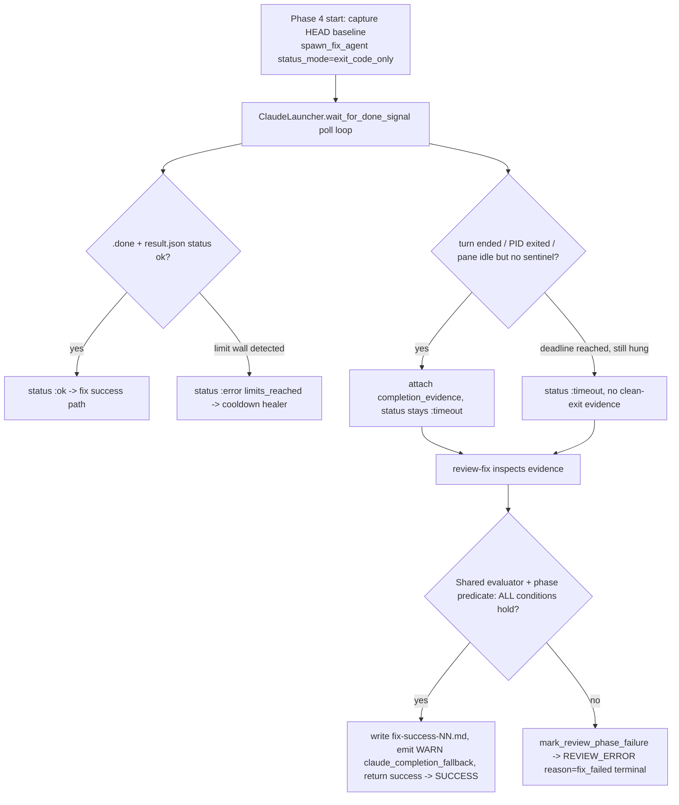

# Plan: fix-review-stage-claude-stop (tmux stop-hook completion fallback)

**Type:** fix
**Origin:** brainstorm.md (this stage)
**Depth:** Deep — cross-cutting change to the shared tmux Claude completion/control-plane path, plus root-cause investigation, recovery, and docs.
**Target repo:** hive (paths below are repo-relative to `<REPO_ROOT>`)

---

## Overview

In tmux mode the hive daemon launches Claude as an interactive REPL inside a tmux
pane and detects completion via a Stop hook that writes two sentinel files under the
orchestrator-owned task folder: `result.json` and `.done`
(`lib/hive/scripts/stop_hook.sh`). The review-fix phase
(`6-review-fix-pass`) waits for those files in `ClaudeLauncher.wait_for_done_signal`
(`lib/hive/claude_launcher.rb:811`). When the hook never writes the sentinel,
`wait_for_done_signal` drains to its deadline and returns
`{status: :timeout, error_message: "claude stop hook did not signal completion"}`
(`lib/hive/claude_launcher.rb:852`). The review stage treats `:timeout` as
`agent_failed?` (`lib/hive/stages/review.rb:2113`) and stamps a **terminal**
`REVIEW_ERROR phase=fix reason=fix_failed pass=N` marker
(`mark_review_phase_failure`, `lib/hive/stages/review.rb:871`) — even when Claude
actually finished, produced artifacts, and auto-committed. This has already stranded
completed work on tasks 58/PR #622, 287/PR #623, and 288/PR #624. The active
mitigation is `claude.mode: headless`, which bypasses the tmux completion path
entirely.

This plan delivers two things in one change-set:

1. **(a) Root-cause investigation + fix where practical** of the missing/late Stop-hook
   signal in interactive tmux mode, documented even if not deterministically reproduced.
2. **(b) A tolerant completion fallback** in the shared tmux completion path so that a
   clean Claude exit plus verifiable artifacts/commit is accepted as success instead of
   being mis-stamped `REVIEW_ERROR`. The fallback is implemented in the shared path so
   every tmux-launched phase can benefit, but is *wired and acceptance-tested first*
   for review-fix (the observed production failure). When the fallback fires it emits a
   non-error WARN audit event `claude_completion_fallback` and the stage proceeds to
   SUCCESS. Genuine failures (crash, exit≠0, unreadable/gone tmux, missing required
   artifacts, unresolved escalation, missing-output marker) still produce the terminal
   `REVIEW_ERROR`.

The change also includes recovery guidance for the three stuck tasks and an operator
docs update covering the headless workaround and recovery commands. Local config is not
auto-reverted.

---

## Requirements Trace

Requirement IDs are derived from the brainstorm's Requirements section.

| ID | Requirement | Addressed by |
|----|-------------|--------------|
| R1 | Investigate & where practical fix the real tmux Stop-hook signaling root cause; document most likely cause + files even if unproven | U5 |
| R2 | Add a tolerant completion fallback in the **shared** tmux completion path; gate first acceptance tests on review-fix | U1, U3, U4 |
| R3 | Suppress `REVIEW_ERROR` only when ALL predicate conditions hold (process exited 0; normal completion observed; artifacts exist & parse; commit-since-pass-start OR explicit no-change evidence; worktree readable; no unresolved escalation; no missing-output marker) | U3, U4 |
| R4 | Preserve strict-failure behavior (real missing-output, crash, exit≠0, unreadable/gone tmux, missing artifacts → terminal `REVIEW_ERROR`); tmux cleanup still runs | U1, U3, U4 |
| R5 | Emit non-error WARN event `claude_completion_fallback` with full payload (phase, pass, pid/session, expected sentinel path, missing-signal reason, artifacts checked, commit/no-change evidence, task slug); stage reaches SUCCESS with no new terminal marker | U2, U4 |
| R6 | Provide recovery for tasks 58/PR #622, 287/PR #623, 288/PR #624: prefer safe automatic re-evaluation, else documented exact `hive markers clear … && hive run …` commands; never silently clear without auditable evidence | U6 |
| R7 | `claude.mode: headless` remains recommended workaround; do not auto-revert local/operator config; document workaround + recovery | U6 |
| R8 | `stop_hook_installer` tests assert the exact sentinel/result file paths `ClaudeLauncher` expects | U5 |
| R9 | Review-stage test asserts the `claude stop hook did not signal completion` message path is reached only on genuine failure, not on clean-exit-with-artifacts | U4 |

---

## Scope Boundaries

**In scope**
- Completion-evidence gathering in the shared tmux wait path (`wait_for_done_signal`).
- A shared, phase-agnostic completion-fallback predicate evaluator.
- Wiring the predicate into the review-fix phase (Phase 4 of `lib/hive/stages/review.rb`),
  including pass-start commit baseline capture and no-change evidence detection.
- New WARN audit event type `claude_completion_fallback`.
- Root-cause investigation + documentation of the Stop-hook signaling failure.
- `stop_hook_installer` path-contract tests and review-stage failure-path tests.
- Operator docs (workaround + recovery) and recovery commands for the three stuck tasks.

**Out of scope / Deferred to Follow-Up Work**
- Wiring the fallback predicate into the other tmux exit_code_only consumers (the
  4-execute implementer path, review ci_fix/triage/browser_test wrappers). The shared
  evidence and evaluator are built so these can opt in later; this change deliberately
  leaves their *behavior* unchanged to keep blast radius small (see Open Question Q1).
- Changing the default `claude.mode` back to `tmux`. Headless stays the recommended
  workaround until this fix is released and verified (R7).
- Auto-reverting any local/operator config.
- Any change to the headless completion path (`Hive::Stages::Base.spawn_agent`), which
  is unaffected by the tmux signaling bug.

---

## Key Technical Decisions

**KTD1 — Enrich the wait result with completion evidence; do NOT change its `status`.**
`wait_for_done_signal` is shared by the 4-execute implementer path, whose classifier
reads `:timeout` as `implementer_failed`. Changing the returned status symbol would
silently alter execute-stage behavior. Instead, attach a new `completion_evidence:` key
to the existing return hash and keep `status: :timeout` unchanged. Callers that ignore
the key behave exactly as today; only review-fix inspects it. This is the minimal-blast <!-- hive-bench: repo-state assertion, verify against the restored base -->
-radius way to satisfy "implement in the shared path so every phase *can* benefit" (R2)
while preserving R4 for un-wired phases. Mirrors the existing precedent at
`lib/hive/claude_launcher.rb:824-830`, where the same loop already surfaces a richer
result for a detected usage wall.

**KTD2 — Detect "completed but unsignaled" during the poll loop, not only at deadline.**
If the fallback only evaluated at the full `timeout_sec` (review_fix default 2700s), every
unsignaled-but-complete pass would block ~45 min before succeeding. During the existing
poll loop, additionally detect the "agent turn ended / process idle or exited" condition
(pane returned to the ready prompt per the `claude_ready_prompt?` machinery at
`lib/hive/claude_launcher.rb:610`, and/or the recorded Claude PID is no longer running)
and capture evidence then, so the fallback resolves promptly. The deadline path remains as
the backstop. Evidence is advisory data only — it never by itself flips `status`.

**KTD3 — Split the predicate into a generic layer (launcher/shared) and a phase layer (review).**
The generic conditions (process exited cleanly / turn ended normally vs crash-or-kill;
tmux readable; no limit wall; no missing-output) are computed by the shared evaluator from
the launcher's evidence. The phase-specific conditions (required artifacts exist & parse;
commit-since-pass-start OR explicit no-change evidence; no unresolved escalation) are
supplied by the review stage. Suppression requires ALL conditions across both layers (R3).

**KTD4 — Reuse existing review-stage helpers for the phase predicate.** Artifact presence
uses the existing `reviews/escalations-NN.md` / `reviews/fix-success-NN.md` conventions and
`fix_success_fresh?` (`lib/hive/stages/review.rb:1076`). Commit-since-pass-start uses a
HEAD baseline captured before the fix agent runs, compared via
`Hive::Stages::AutoCommit.git_head` (`lib/hive/stages/review.rb:1912`). Worktree readability
and clean/dirty use `worktree_status` (`lib/hive/stages/review.rb:2067`). Escalation count
uses `count_escalations` (`lib/hive/stages/review.rb:1631`). No new git/artifact machinery is
invented.

**KTD5 — Fallback success writes the normal per-pass sentinel.** When the predicate is
satisfied, review-fix writes `reviews/fix-success-NN.md` via the existing `write_fix_success`
(`lib/hive/stages/review.rb:1890`) so downstream pass-state classification
(`fix_success_fresh?`) treats the pass as legitimately complete, then emits the WARN event
and returns a success (non-`:review_error`) result — instead of calling
`mark_review_phase_failure`.

---

## High-Level Technical Design

Control flow for a single review-fix pass under tmux mode (the new fallback branch is the
right-hand path):



Sentinel-path contract that U5 locks down with tests:

```text
ClaudeLauncher.done_path(task)   == File.join(task.folder, ".done")
ClaudeLauncher.result_path(task) == File.join(task.folder, "result.json")
StopHookInstaller settings hook  == stop_hook.sh with HIVE_TASK_STAGE_DIR=<task.folder>
stop_hook.sh writes              == $HIVE_TASK_STAGE_DIR/result.json AND touch $HIVE_TASK_STAGE_DIR/.done
```

---

## Implementation Units

### U1. Gather completion evidence in the shared tmux wait path

**Goal:** Make `wait_for_done_signal` capture whether Claude completed/exited cleanly (vs
crashed, was killed, or is genuinely still working) when the sentinel is absent, and attach
that evidence to its return hash — without changing the returned `status`.

**Requirements:** R2, R4.

**Dependencies:** none.

**Files:**
- `lib/hive/claude_launcher.rb` (modify `wait_for_done_signal` ~`:811`; add evidence helper(s); likely reuse `claude_ready_prompt?` ~`:610`, `record_claude_pid`, and pane-tail capture).
- `test/unit/claude_launcher_test.rb` (tests).

**Approach:**
- During the existing poll loop, in addition to the `.done`/limit-wall checks, evaluate a
  "turn ended but unsignaled" condition: the pane tail matches the ready-prompt regex
  (`CLAUDE_READY_PROMPT_LINE`, indicating the agent turn finished and returned to the REPL)
  and/or the recorded Claude PID is no longer alive. When that holds and no sentinel exists, <!-- hive-bench: repo-state assertion, verify against the restored base -->
  break and return with `status: :timeout` (unchanged) plus a new
  `completion_evidence:` hash: `{process_exited:, exit_code:, pane_idle:, sentinel_present: false, expected_done_path:, expected_result_path:, session_alive:, reason: "..."}`.
- At the deadline backstop, return the same shape but with evidence reflecting a still-busy /
  no-clean-exit state (so the predicate in U3/U4 will *not* suppress).
- Keep all current return shapes for the `:ok`, limit-wall `:error`, and `result.json`-status
  branches intact. Evidence is additive metadata only (KTD1, KTD2).
- Be nil-runner / `TmuxError` safe, matching `capture_limit_tail`.

**Patterns to follow:** the limit-wall surfacing block at `lib/hive/claude_launcher.rb:824-830`
(richer result from inside the same loop); `prepare_claude_session!`/`claude_ready_prompt?`
ready-prompt detection (`:543`, `:610`); `done_path`/`result_path` (`:1062`).

**Test scenarios:**
- Sentinel present with `result.json` status ok → returns `status: :ok` unchanged, no behavior change. (regression guard)
- Limit wall in pane → returns `status: :error` with limit message unchanged. (regression guard)
- No sentinel, pane shows ready prompt (turn ended) before deadline → returns `status: :timeout` with `completion_evidence[:pane_idle] == true` / `process_exited`/`session_alive` populated and resolves without waiting the full timeout.
- No sentinel, recorded PID gone before deadline → evidence reflects `process_exited: true`.
- No sentinel, pane still mid-work until deadline → returns `status: :timeout` with evidence indicating no clean exit (`pane_idle: false`).
- nil runner / `TmuxError` during evidence capture → no raise; evidence degrades to a safe "unknown/not-clean" shape.

**Verification:** `wait_for_done_signal` returns the documented evidence shape for each
case; existing execute-path callers (which ignore the key) observe identical `status`
outcomes to pre-change behavior.

---

### U2. Add the `claude_completion_fallback` WARN audit event type

**Goal:** Register a new non-error event type so the fallback can be audited via
`events.jsonl` without introducing a terminal marker.

**Requirements:** R5.

**Dependencies:** none.

**Files:**
- `lib/hive/events.rb` (add `claude_completion_fallback` to `EVENT_TYPES` ~`:8-17`).
- `test/unit/events_test.rb` (or the existing events test file — confirm path at impl time).

**Approach:**
- Add `claude_completion_fallback` to the `EVENT_TYPES` allowlist so `Hive::Events.emit`
  accepts it (it raises `ArgumentError` on unknown types today). Emission itself is done by <!-- hive-bench: repo-state assertion, verify against the restored base -->
  U4 via the standard `Hive::Events.emit(task_folder:, slug:, stage:, event_type:, agent:, message:)`
  API. Payload fields that don't map to the fixed columns are encoded into `message`
  (capped at `MAX_MESSAGE_BYTES` 1024) as a compact `key=value` summary.

**Patterns to follow:** existing entries in `EVENT_TYPES` (`lib/hive/events.rb:8-17`),
especially `clean_exit_auto_committed` as the closest non-error precedent.

**Test scenarios:**
- `Hive::Events.emit(event_type: :claude_completion_fallback, …)` appends a well-formed JSONL record and does not raise.
- An unknown event type still raises `ArgumentError` (regression guard that the allowlist is still enforced).
- A long composed message is truncated to `MAX_MESSAGE_BYTES` with the truncation suffix.

**Verification:** event round-trips through `emit` and appears in `events.jsonl`; allowlist
enforcement unchanged for other types.

---

### U3. Shared completion-fallback predicate evaluator (generic layer)

**Goal:** A small, phase-agnostic helper that decides whether the *generic* preconditions
for suppression hold, given the launcher's `completion_evidence` plus phase-supplied facts.

**Requirements:** R2, R3, R4.

**Dependencies:** U1.

**Files:**
- `lib/hive/claude_completion_fallback.rb` (new module — generic evaluator) OR a module
  method on `ClaudeLauncher`; decide placement at impl time to match repo conventions (Q4).
- `test/unit/claude_completion_fallback_test.rb` (new).

**Approach:**
- Expose a pure function, e.g. `suppress?(evidence:, phase_facts:)` returning a structured
  decision `{suppress: bool, reason:, missing: [...]}`. Generic conditions evaluated here:
  process exited cleanly / turn ended normally (from evidence; crash-or-kill → false),
  exit code 0 when known, tmux/worktree readable, no limit-wall reason, no missing-output
  flag. Phase-specific booleans (artifacts present & parse, commit-or-no-change evidence,
  no unresolved escalation) are passed in by the caller (U4) as `phase_facts` so the
  evaluator stays reusable across phases.
- The decision is conservative: any unknown/ambiguous generic signal defaults to
  `suppress: false` (preserve strict failure, R4).
- Pure and side-effect free: no event emission, no file writes, no marker changes — those
  belong to the caller (U4). This keeps it unit-testable and reusable by future phases.

**Patterns to follow:** small pure predicate modules in `lib/hive/` (e.g. the style of
`Hive::AgentLimit.limit_reached?`); `worktree_status` semantics (`:clean`/`:dirty`/
`[:status_failed, …]`).

**Test scenarios:**
- All generic conditions ok + all phase_facts true → `suppress: true`.
- Process did not exit cleanly (crash/kill evidence) → `suppress: false`, `missing` includes the clean-exit reason.
- Generic ok but phase_facts says artifacts missing → `suppress: false`.
- Generic ok but phase_facts says neither commit nor no-change evidence → `suppress: false`.
- Generic ok but unresolved escalation flag → `suppress: false`.
- Unknown/ambiguous evidence (e.g. `pane_idle: nil`) → `suppress: false` (conservative default).
- Limit-wall reason present → `suppress: false` (must remain a limits path, not a fallback success).

**Verification:** truth-table tests cover each suppression-blocking condition independently;
no condition alone can produce `suppress: true`.

---

### U4. Wire the fallback into the review-fix phase

**Goal:** Make Phase 4 of the review stage capture a pass-start commit baseline, consume the
launcher evidence, evaluate the full predicate (generic + phase), and — only when ALL hold —
write the per-pass success sentinel, emit the WARN `claude_completion_fallback` event, and
return SUCCESS instead of stamping the terminal `REVIEW_ERROR`. Genuine failures still stamp
`REVIEW_ERROR`.

**Requirements:** R3, R4, R5, R9.

**Dependencies:** U1, U2, U3.

**Files:**
- `lib/hive/stages/review.rb` (Phase 4 in `run!` ~`:496-571`; `spawn_fix_agent` ~`:1703`;
  add pass-start HEAD capture; no-change evidence detection; fallback branch before
  `mark_review_phase_failure`).
- `test/integration/run_review_test.rb` and/or `test/unit/stages/review/run_reviewers_test.rb`.

**Approach:**
- Before launching the fix agent, capture `baseline_head = git_head(ctx.worktree_path)`
  (`AutoCommit.git_head`) and record session/pid context for the audit payload.
- After `spawn_fix_agent`, when `agent_failed?(fix_result)` is true AND the result carries
  `completion_evidence` (i.e. the tmux clean-exit-without-signal shape), assemble
  `phase_facts`:
  - artifacts: `reviews/escalations-NN.md` exists & parses; the fix can write/verify
    `reviews/fix-success-NN.md` (via the existing path helpers).
  - commit-or-no-change: a new commit exists since `baseline_head` (`git_head` differs /
    `worktree_status` shows the auto-commit landed) **OR** explicit "no code changes needed /
    all findings already resolved" evidence is present in the review artifacts. Define the
    exact no-change evidence token/marker at impl time (Open Question Q2) — e.g. an explicit
    no-fix/all-resolved annotation already produced by the triage/fix flow.
  - no unresolved escalation: `count_escalations(ctx) == 0`.
  - no missing-output marker.
- Call the U3 evaluator. If `suppress: true`: `write_fix_success(ctx_pass)`, emit
  `Hive::Events.emit(event_type: :claude_completion_fallback, …)` with the full payload
  (phase, pass, pid/session, expected sentinel path from evidence, missing-signal reason,
  artifacts checked, commit/no-change evidence, task slug), and return a non-`:review_error`
  success result so the pass proceeds toward SUCCESS.
- If `suppress: false` (or no `completion_evidence`, i.e. a non-tmux / genuinely-hung
  failure): fall through to today's `mark_review_phase_failure(phase: :fix, <!-- hive-bench: repo-state assertion, verify against the restored base -->
  terminal_reason: "fix_failed", …)` exactly as now — the
  `"claude stop hook did not signal completion"` message path is reached only here (R9).
- Do not alter the limit-reached branch (`mark_review_phase_failure` already routes limits to
  `reason=limits_reached` + retry; KTD1/U1 keep the limit-wall result intact).
- tmux cleanup in `with_shared_session` `ensure` is untouched (R4).

**Execution note:** Start with the failing review-stage test that asserts a clean-exit-with
-artifacts pass does NOT reach `REVIEW_ERROR`, then implement to green; add the genuine-
failure test alongside.

**Patterns to follow:** the Phase 4 error-handling block (`lib/hive/stages/review.rb:563-571`);
`write_fix_success` (`:1890`); `fix_success_fresh?` (`:1076`); `count_escalations` (`:1631`);
phase-event emission already in the stage (the `agent_start`/`agent_end` emit calls).

**Test scenarios:**
- Covers AE1 / R3, R5. Tmux review-fix: fix agent returns `:timeout` + clean-exit evidence, `escalations-NN.md` present, a new commit exists since baseline → stage does NOT stamp `REVIEW_ERROR`; `reviews/fix-success-NN.md` written; one `claude_completion_fallback` WARN event emitted with full payload; pass returns success.
- No-code-change variant: same as above but no new commit and explicit no-change evidence present → suppressed to SUCCESS.
- Covers AE2 / R4. Tmux review-fix: fix agent crashed / exit≠0 / unreadable-or-gone tmux (evidence not clean) → still stamps terminal `REVIEW_ERROR reason=fix_failed`; no fallback event.
- Missing required artifact (`escalations-NN.md` absent) despite clean exit → `REVIEW_ERROR` (predicate fails on artifacts).
- Clean exit + artifacts but a new commit is required (pass claims code change) yet none exists and no no-change evidence → `REVIEW_ERROR` (predicate fails on commit/no-change).
- Unresolved escalation present → `REVIEW_ERROR` even with clean exit + commit.
- Covers R9. Genuine hang (no `completion_evidence`, deadline reached still busy) → reaches the `"claude stop hook did not signal completion"` message path and stamps `REVIEW_ERROR`.
- Limit wall during fix → routed to `limits_reached` (retry), not fallback success and not `fix_failed`.

**Verification:** the two acceptance examples from the brainstorm pass; the genuine-failure
matrix still terminates in `REVIEW_ERROR`; exactly one WARN event per fallback; the audit
payload contains every required field.

---

### U5. Root-cause investigation, sentinel-path contract tests, and findings doc

**Goal:** Investigate why the Stop hook fails to signal in interactive tmux mode, document the
most likely cause and the files/paths involved (even if not deterministically reproduced), and
lock the sentinel/result path contract with tests so launcher and installer cannot drift.

**Requirements:** R1, R8.

**Dependencies:** none (can proceed in parallel with U1–U4).

**Files:**
- `lib/hive/scripts/stop_hook.sh`, `lib/hive/stop_hook_installer.rb`, `lib/hive/claude_launcher.rb`
  (read/investigate; small fix only if a concrete, safe cause is confirmed).
- `test/unit/stop_hook_installer_test.rb` (path-contract assertions).
- A findings note appended to the operator docs from U6 (or a short `docs/` note) capturing
  the leading hypothesis and follow-up.

**Approach:**
- Investigate the leading hypothesis: the `Stop` hook firing semantics differ between headless
  `claude -p` and the interactive tmux REPL (the hook may not fire, or fire without writing,
  when the turn ends in the REPL), versus alternatives — `set -eu` aborting `stop_hook.sh`
  before `touch .done` if the `result.json` write fails; read-only (`0o444`) settings or a
  project-settings merge dropping the hook; a pane race; or `reset_signal_files`/cleanup timing.
- Document the most likely cause, the involved files
  (`claude_launcher.rb`, `stop_hook_installer.rb`, `scripts/stop_hook.sh`, review wrappers),
  and a clear follow-up note if the exact race is not deterministically reproduced (R1 permits
  shipping the fallback without a proven root cause).
- Apply a concrete signaling fix only if investigation yields a safe, confirmed one (e.g. a
  hardening tweak to `stop_hook.sh` ordering). Otherwise leave the fallback (U1–U4) as the
  safety net and record the follow-up.
- Add tests asserting the exact paths `ClaudeLauncher` expects match what `StopHookInstaller`
  configures and what `stop_hook.sh` writes (R8): `.done` and `result.json` under
  `task.folder`, hook command carries `HIVE_TASK_STAGE_DIR=<task.folder>`.

**Patterns to follow:** existing `test/unit/stop_hook_installer_test.rb` cases (settings
creation, read-only mode, backup, `extra_dirs`); `done_path`/`result_path` (`claude_launcher.rb:1062`).

**Test scenarios:**
- `StopHookInstaller.install(stage_dir:, extra_dirs:)` writes a hook whose command sets `HIVE_TASK_STAGE_DIR` to `stage_dir`, and the configured result path equals `ClaudeLauncher.result_path` for a task whose folder is `stage_dir`.
- The installed hook script is the canonical `scripts/stop_hook.sh` path and is read-only (existing guard preserved).
- `extra_dirs` (worktree cwd) also receives a hook pointing `HIVE_TASK_STAGE_DIR` back at the orchestrator `stage_dir`, not at the worktree. (regression guard for the review-fix cwd case)

**Verification:** path-contract tests pass and would fail if launcher or installer paths drift;
a written findings note names the leading cause, the files, and the follow-up.

---

### U6. Operator docs: workaround, recovery commands, and stuck-task recovery

**Goal:** Document that `claude.mode: headless` remains the recommended workaround, do not
auto-revert config, and provide auditable recovery for the three stuck tasks.

**Requirements:** R6, R7.

**Dependencies:** U4 (recovery references the new predicate/event), U5 (findings note).

**Files:**
- The relevant operator doc under `docs/` (confirm the exact file at impl time — e.g. a
  troubleshooting/operations page; do not invent a new top-level doc if a fitting one exists).
- `CHANGELOG.md` (note the fix and the retained headless recommendation).

**Approach:**
- State that headless mode remains the recommended workaround for affected versions and that
  tmux is safe only once this fix is present; explicitly note that local/operator config is not
  auto-reverted by this change.
- Document recovery for tasks 58/PR #622, 287/PR #623, 288/PR #624. Prefer a safe automatic
  re-evaluation **only** when the new predicate can prove completion from on-disk evidence
  (artifacts + commit/no-change) — otherwise document the exact manual sequence, e.g.
  `hive markers clear <FOLDER> --name REVIEW_ERROR [--match-attr reason=fix_failed]`
  followed by `hive run …`, using the documented `hive markers clear` surface
  (`lib/hive/cli.rb:874-878`). Require operators to confirm artifacts/commit exist before
  clearing — never silently clear without auditable evidence (R6).
- Keep this as guidance/commands; an automated re-evaluation tool is an Open Question (Q3), not
  a committed deliverable.

**Test scenarios:** `Test expectation: none — documentation and changelog only.` (No behavioral
code; correctness is verified by review of the documented commands against the real
`hive markers clear` flags.)

**Verification:** docs accurately describe the workaround, the no-auto-revert stance, and a
recovery sequence whose flags match `hive markers clear`/`hive run`; the three tasks are named
with explicit pre-clear evidence checks.

---

## Risks

- **R-A: Changing `wait_for_done_signal` perturbs the 4-execute path.** Mitigated by KTD1 —
  status symbol and all existing return branches are unchanged; only an additive
  `completion_evidence:` key is introduced, which execute ignores. Regression tests in U1
  assert identical `status` outcomes.
- **R-B: A too-loose predicate accepts a genuinely failed pass as success (masking real
  failures).** Mitigated by R3's full conjunction, U3's conservative "unknown → don't
  suppress" default, the requirement of artifacts + (commit OR explicit no-change), and the
  genuine-failure test matrix in U4. The WARN event makes every suppression auditable.
- **R-C: "Clean exit" is hard to detect reliably in an interactive tmux REPL.** Pane-idle
  detection can race or mis-read. Mitigated by combining pane-idle with PID/session liveness
  and by defaulting to non-suppression on ambiguity; worst case degrades to today's behavior <!-- hive-bench: repo-state assertion, verify against the restored base -->
  (`REVIEW_ERROR`), never to a false success.
- **R-D: Root cause may not be reproducible.** Accepted per R1 — ship the fallback as the
  safety net and record a follow-up. The fallback's value does not depend on a proven cause.
- **R-E: Recovery commands clear a marker on a task that did NOT actually complete.** Mitigated
  by requiring on-disk artifact + commit/no-change evidence before any `markers clear`, and by
  preferring automatic re-evaluation only when the predicate can prove completion (R6).
- **R-F: No-change evidence token is underspecified.** The exact "no code changes needed / all
  findings already resolved" marker the fix/triage flow emits must be pinned to avoid both
  false accepts and false rejects (Open Question Q2).

---

## Open Questions (for reviewer)

- **Q1 — Scope of wiring:** This plan builds the fallback in the *shared* path (U1, U3) but
  only *wires* it into review-fix (U4), leaving the 4-execute implementer path and review
  ci_fix/triage/browser_test wrappers behavior-unchanged for now (per the brainstorm's "gate
  first acceptance tests around review fix"). Confirm that is the intended landing for this
  task, or should the execute path also be wired in this change?
- **Q2 — No-change evidence token:** What exact artifact marker should count as "no code
  changes needed / all findings already resolved" for the commit-OR-no-change condition? Is
  there an existing token the fix/triage flow already writes (e.g. an all-resolved/no-fix
  annotation), or should U4 define one?
- **Q3 — Automatic re-evaluation vs documented commands for the three stuck tasks:** Do you
  want U6 to ship an actual safe auto-re-evaluation path (re-run the predicate against the
  stuck tasks' on-disk evidence and clear `REVIEW_ERROR` automatically when proven), or is
  documented manual `hive markers clear … && hive run …` with a mandatory evidence check
  sufficient for this task?
- **Q4 — Evaluator placement:** New top-level `lib/hive/claude_completion_fallback.rb` module
  vs a method on `ClaudeLauncher`. Preference?

<!-- COMPLETE -->
