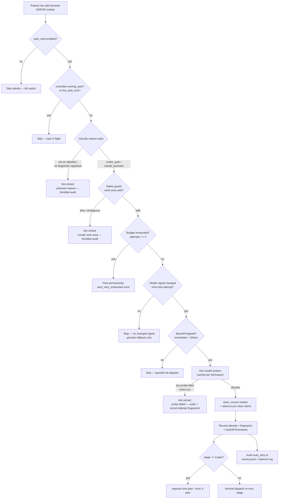

# Plan: Daemon auto-retry of recoverable terminal error markers

**Type:** feat
**Origin:** `brainstorm.md` (this stage directory) — user-curated, `<!-- COMPLETE -->`
**Target repo:** hive (`<REPO_ROOT>`; all paths below are repo-relative)
**Depth:** Deep
**Execution posture:** Test-first for the policy/probe units — the daemon healer family is safety-relevant and already unit-tested without forking (`test/unit/daemon/*`); new decision logic should land with failing tests first.

---

## Overview

When a task parks on a terminal `ERROR` marker that was caused by a *transient dependency outage* — Codex auth missing (`reason=implementer_failed` whose message is a `401 Missing bearer/basic auth`) or a Claude launcher/readiness failure (`reason=claude_launch_failed`) — the daemon currently leaves it parked forever, requiring a human `hive markers clear`. We hit this on 2026-06-29: task 58 (Codex 401) and task 287 (Claude launcher pre-patch) both stayed red after their underlying dependency was fixed and verified healthy. <!-- hive-bench: repo-state assertion, verify against the restored base -->

This feature adds a **health-probe-gated auto-retry** path to the daemon. On each tick the daemon evaluates parked tasks holding a *known recoverable* marker, and only when (a) the marker matches a fixed v1 allowlist with a recognized diagnostic signature, (b) the relevant dependency now passes a health probe, (c) the work area is safe to re-run, and (d) the health signal has changed since the last failed attempt and retry budget/backoff allow — it clears the marker and lets the normal dispatch loop re-run the stage from the start. Every decision (retry and not-retried) is audited to both the task `events.jsonl` and the daemon log. A global kill-switch (`daemon.auto_retry.enabled`) disables the whole behavior.

The mechanism is deliberately equivalent to a manual `hive markers clear` + re-enqueue: no special resume path, no new forward-advance approval logic. It reuses the established marker-clear primitives (`Hive::Markers.clear_current`), the dispatch-baseline seeding pattern, and the `3-plan` requeue exception already proven by `Hive::Daemon::StaleAgentHealer`.

### Key architectural decision

The new policy (health probes, signal fingerprinting, changed-signal gating, 2-retry + 30-minute backoff, dual-channel audit, safety guards, diagnostic-signature classification) is substantially more complex than the synchronous, no-I/O `auto_recoverable_error?` path in `StaleAgentHealer`. Rather than overload that well-tested module, this plan introduces a **new sibling component `Hive::Daemon::RecoverableErrorHealer`** wired into the same tick slot, immediately after `StaleAgentHealer`. The two never contend: `StaleAgentHealer` does not handle `implementer_failed` or `claude_launch_failed` reasons (verified — its allowlist is `unpushed_commits`, `limits_reached`, `timeout`, `ensure_clean_on_exit_failed`, `tmux_session_terminated`, `agent_orphaned`), and the new healer handles *only* those two reasons. Shared mechanics (marker-clear, pre-clear mtime observation, `3-plan` requeue) are factored into small reusable helpers. See KTD-1 and Alternatives.

---

## High-Level Technical Design

Per-row auto-retry decision (runs once per parked recoverable row per tick, inside `RecoverableErrorHealer#heal`):



Health-signal fingerprint composition (directional — the exact field set is finalized in U4):

```
fingerprint(reason) = sha256(join(
  hive_version,                      # Hive::VERSION
  daemon_binary_path,                # $PROGRAM_NAME / resolved bin
  reason_specific_inputs(reason)
))

reason_specific_inputs(:codex_auth)     = [ ENV["CODEX_HOME"], codex_bin,
                                            auth_json_present?, auth_json_mtime ]
reason_specific_inputs(:claude_launcher)= [ claude_bin, claude_version,
                                            wrapper_file_mtime, doctor_rows_digest ]
```

---

## Requirements Trace

Requirements derive from `brainstorm.md` (Requirements section + Acceptance examples). IDs are plan-local.

| ID | Requirement (from brainstorm) | Unit(s) |
|----|-------------------------------|---------|
| R1 | Fixed v1 allowlist only: `implementer_failed` *iff* Codex 401 auth signature; `claude_launch_failed` *iff* launcher probe passes. Exclude business-logic/test/review/merge/dirty/unknown failures. | U2, U6 |
| R2 | Universal precondition: lightweight `hive doctor` / agent-health pass before any auto-retry. | U3, U6 |
| R3 | Codex auth recovery probe: `codex login status` logged-in AND a tiny `codex exec` smoke test succeeds in the daemon's environment. | U3 |
| R4 | Claude launcher recovery probe: wrapper file exists in active install + ready-detector check passes + active binary/version matches CLI + doctor green. | U3 |
| R5 | Probe execution model: mix in-process + shell-out; short timeout (10–30s); capture stdout/stderr; timeout/error ⇒ not healthy; cache per tick/reason. | U3 |
| R6 | Trigger on daemon ticks, throttled per task/reason; re-probe on changed health signal (binary/version/fingerprint, config/env, plugin/skill inventory, Codex login state, wrapper mtime, manual clear/retry event); low-frequency periodic re-probe as fallback. | U4, U6, U8 |
| R7 | Max 2 auto-retries per task per reason; changed health signal required before each retry; backoff immediate → +30 min; on exhaustion park permanently (manual clear required). | U6 |
| R8 | Safety guard: only retry when stage produced no terminal success output and work area is safe (execute worktree clean / only known-safe agent files; brainstorm/plan no answered user content overwritten); when uncertain, do not retry. | U5, U6 |
| R9 | Mechanics: equivalent to manual `hive markers clear` + re-enqueue/run same stage from start; no special resume path; rest of pipeline sees identical state transitions. | U6 |
| R10 | Audit to both task `events.jsonl` and daemon log: task slug/id, stage, marker id, reason, probe names/results, health-signal fingerprint, attempt count, action, rationale, timestamp; record throttled negative (not-retried) decisions. | U7, U6 |
| R11 | Enabled by default for v1 allowlisted recoveries; global kill-switch `daemon.auto_retry.enabled: false`; per-reason limits/backoff deferred (hardcoded v1). | U1 |
| R12 (AE) | Acceptance examples: task-58 Codex auth auto-clears within one cycle; task-287 Claude launcher auto-clears only after all checks; unknown `implementer_failed` stays parked; 2-retry limit + backoff respected; dirty worktree / ambiguous output not retried; probe hang ⇒ not retried; kill-switch off ⇒ no behavior. | U9 |

---

## Scope Boundaries

**In scope (v1)**
- Auto-retry for exactly two marker reasons under recognized diagnostic signatures: Codex-auth `implementer_failed` and `claude_launch_failed`.
- Health probes (doctor universal precondition, Codex auth, Claude launcher), per-tick/reason caching, timeouts, captured output.
- Health-signal fingerprinting and changed-signal gating with periodic fallback.
- 2-retry budget + immediate/+30-min backoff, permanent park on exhaustion.
- Safety guard against discarding user work.
- Dual-channel audit (events.jsonl + daemon log), including throttled negative decisions.
- Global `daemon.auto_retry.enabled` kill-switch (default on for v1 allowlist).

**Deferred to follow-up work**
- Per-reason / per-repo config tuning of limits and backoff (brainstorm A9 — explicitly deferred; v1 hardcodes).
- Expanding the allowlist to other reasons (`gh` auth, network, additional transients).
- Persisting retry budgets/fingerprints across daemon restarts (v1 budgets are in-memory, mirroring `StaleAgentHealer`; restart resets — acceptable, noted in Risks).
- Parsing the provider's wall-clock reset hint for backoff (fixed 30-min is the v1 default, consistent with existing `limits_reached` cooldown design).

**Out of scope (non-goals)**
- Auto-clearing business-logic failures, test failures, review findings, merge conflicts, dirty-worktree failures, unknown `exit_code=1`, or any marker without a recognized diagnostic signature.
- Any new forward-advance/approval logic (the daemon trust boundary is unchanged — clearing a recovery marker only re-runs the same stage).
- A special "resume mid-stage" path.

---

## Key Technical Decisions

**KTD-1 — New `Hive::Daemon::RecoverableErrorHealer` rather than extending `StaleAgentHealer`.**
The new path needs blocking health probes (shell-outs with timeouts/caching), fingerprint comparison, backoff timestamps, and dual-channel audit — none of which fit `StaleAgentHealer`'s synchronous, I/O-free `auto_recoverable_error?` contract. A sibling module keeps both testable and the existing healer untouched. Shared low-level helpers (marker clear + pre-clear mtime observe + `3-plan` requeue) are extracted so behavior stays consistent. *Alternative considered:* extend `StaleAgentHealer` with a probe-gated branch — rejected because it would intermix a pure decision module with network I/O and roughly double its surface.

**KTD-2 — Record `provider` on the `implementer_failed` marker.**
`mark_implementer_failure` in `lib/hive/stages/execute.rb` currently records `reason/status/message` but not which agent ran. Classifying "Codex auth failure" robustly needs both the message signature (`401` + `Missing bearer`/`basic auth`) *and* confirmation the executor was Codex. Add `provider: execute_agent_name(cfg)` to the marker attrs (mirrors what `limits_reached` already records). Classification still tolerates legacy markers lacking `provider` by falling back to message-signature-only. <!-- hive-bench: repo-state assertion, verify against the restored base -->

**KTD-3 — Reuse `Hive::Commands::Doctor#rows` in-process for the universal precondition** (no CLI fork), and shell out for `codex`/`claude` because auth and runtime behavior live in those external CLIs (brainstorm A3). All shell-outs use the established `Timeout.timeout(n) { Open3.capture3(...) }` pattern with captured stdout/stderr.

**KTD-4 — In-memory budgets/fingerprints, rebuilt on reload** — mirrors `StaleAgentHealer`'s deliberate per-process budget (a daemon restart/SIGHUP rebuilds the healer and resets counts). Documented as a known trade-off (Risks).

**KTD-5 — Changed-signal gate keyed by `[project, slug, stage, reason]`**, storing the last-attempted fingerprint. A retry is allowed only when the current fingerprint differs from the last failed-attempt fingerprint, with a low-frequency periodic fallback re-probe so a missed signal still eventually recovers (brainstorm A4/A5).

---

## Implementation Units

### U1. Config: `daemon.auto_retry` block + kill-switch

**Goal:** Add the v1 config surface — a global kill-switch with conservative hardcoded limits — and load/validate it. (R11)

**Requirements:** R11.

**Dependencies:** none.

**Files:**
- `lib/hive/config.rb` — add `"auto_retry" => { "enabled" => true }` under `DEFAULTS["daemon"]`; extend the daemon-block validator in `validate!`.
- `config.example.yml` — document the key under a commented `daemon:` example.
- `wiki/commands/daemon.md`, `wiki/modules/config.md` — note the key (per AGENTS.md wiki upkeep; add a `wiki/log.d/<ts>-auto-retry.md` fragment).
- Test: `test/unit/config_test.rb` (or the existing config test file) — defaults + validation.

**Approach:** Follow the existing `daemon` defaults pattern (deep-merge over `DEFAULTS["daemon"]`, read via `config.dig("daemon", "auto_retry", "enabled")`). Default `true` so v1 allowlisted recoveries are on; the kill-switch is `false`. Keep limits/backoff hardcoded in U6 (deferred per brainstorm). Validation: reject a non-boolean `enabled`.

**Patterns to follow:** the existing `daemon` block in `DEFAULTS` and `validate_reviewers!`-style validators in `lib/hive/config.rb`.

**Test scenarios:**
- Default config yields `auto_retry.enabled == true`. Covers R11.
- Explicit `daemon: { auto_retry: { enabled: false } }` overrides to false and round-trips through deep-merge.
- Legacy config with no `auto_retry` key falls back to the default without error.
- Non-boolean `enabled` raises the daemon-block validation error (exit/`Hive::ConfigError`).

**Verification:** Config loads with the new key at default and override; validation rejects malformed input; daemon reads the flag at construction.

---

### U2. Diagnostic classifier for recoverable reasons

**Goal:** A pure function that maps a parked row's marker (`reason` + attrs) to a recoverable category (`:codex_auth`, `:claude_launcher`) or `nil` (not recoverable). Enforces the fixed allowlist and diagnostic-signature requirement. (R1)

**Requirements:** R1.

**Dependencies:** U1 (for the enabled gate, consumed in U6).

**Files:**
- `lib/hive/daemon/recoverable_error_classifier.rb` — new pure module, no I/O.
- `lib/hive/stages/execute.rb` — KTD-2: add `provider:` to the `implementer_failed` marker in `mark_implementer_failure`.
- Test: `test/unit/daemon/recoverable_error_classifier_test.rb`; `test/unit/stages/execute_test.rb` (assert new `provider` attr).

**Approach:** `classify(reason:, attrs:, stage:, workflow:)`:
- `implementer_failed` → `:codex_auth` only when `provider == "codex"` (or absent, legacy) AND `message` matches the Codex auth signature (`/401/` AND /`missing bearer`|`basic auth`/i). Otherwise `nil`.
- `claude_launch_failed` → `:claude_launcher` (the probe in U3 decides health; classification just recognizes the reason and confirms it is not a business-logic shape).
- Everything else (`exit_code`, test failures, review findings, merge/dirty, unknown) → `nil`.
Centralize the signature regexes as named constants so they are auditable and testable.

**Patterns to follow:** `Hive::AgentLimit.limit_reached?(text)` (signature-matching helper) and `StaleAgentHealer#marker_reason` / `marker_attrs_for`.

**Test scenarios:**
- `implementer_failed` with `provider=codex` + message `"... 401 Missing bearer/basic auth ..."` → `:codex_auth`. Covers AE (task-58).
- `implementer_failed` with a business-logic message (no 401 signature) → `nil` (stays parked). Covers AE (unknown implementer_failed).
- `implementer_failed` with `provider=claude` and a 401-looking message → `nil` (Codex-only allowlist).
- Legacy `implementer_failed` with no `provider` attr but a clear 401 signature → `:codex_auth` (fallback).
- `claude_launch_failed` → `:claude_launcher`.
- `exit_code` / `dirty_worktree` / review reasons / arbitrary text → `nil`.
- `mark_implementer_failure` now writes `provider` matching the configured execute agent.

**Verification:** Classifier returns the right category for the two acceptance fixtures and `nil` for all exclusions; the execute marker carries `provider`.

---

### U3. Health probe subsystem

**Goal:** Reason-keyed health probes with short timeouts, captured stdout/stderr, per-tick/reason caching, and "timeout/error ⇒ not healthy". (R2, R3, R4, R5)

**Requirements:** R2, R3, R4, R5.

**Dependencies:** none (consumed by U6).

**Files:**
- `lib/hive/daemon/health_probe.rb` — new; probe registry + runner returning a structured result (`{ ok:, probes: [{name, ok, exit, stdout_tail, stderr_tail, ms}], reason }`).
- Test: `test/unit/daemon/health_probe_test.rb`.

**Approach:**
- **Universal precondition (R2):** run `Hive::Commands::Doctor.new(...).rows` in-process; "green" = no row with status `missing`/`version_too_old`. Reuse, don't fork.
- **Codex auth (R3):** shell out `codex login status` (logged-in check) AND a tiny `codex exec` smoke test, both with the daemon's environment (notably `CODEX_HOME`). Use `Timeout.timeout(t) { Open3.capture3(env, *cmd) }`, `t` per-command 10–30s (codex exec at the high end). Either failing/timing-out ⇒ not healthy.
- **Claude launcher (R4):** in-process wrapper-file existence (`lib/hive/scripts/interactive_claude_wrapper.sh` via `Hive::ClaudeLauncher.wrapper_command` path) + `Hive::ClaudeLauncher.tmux_status` ready/availability check + `claude --version` ≥ `Hive::MIN_CLAUDE_VERSION` via `AgentProfile#check_version!` + doctor green.
- **Caching:** memoize per `(tick_id, reason)` so multiple parked rows of the same reason in one tick trigger one probe set. Cache cleared at tick start.
- **Output capture:** keep bounded stdout/stderr tails on each probe result for audit (U7); never raise out of the runner — exceptions become `ok: false` results.

**Patterns to follow:** `Timeout.timeout(10) { Open3.capture3(bin, "--version") }` in `lib/hive/agent_profile.rb`; doctor's `Open3.capture3` + `Timeout.timeout(15)` for qmd; `Hive::AgentProfiles.logged_in?` for the credential-file location convention.

**Test scenarios:**
- Codex probe: stubbed `codex login status` success + smoke success → `ok: true` with both sub-probe results. Covers AE (task-58).
- Codex probe: `codex login status` reports logged-out → `ok: false`, smoke not run or recorded failed.
- Codex probe: smoke `codex exec` times out → `ok: false` with a timeout-tagged probe result (probe hang ⇒ not healthy). Covers AE (probe hang).
- Claude probe: wrapper missing → `ok: false`; wrapper present + tmux_status ready + version OK + doctor green → `ok: true`. Covers AE (task-287).
- Claude probe: `claude --version` below min → `ok: false` (version_too_old).
- Doctor universal precondition red → overall `ok: false` regardless of reason-specific probes.
- Caching: two calls in one tick for the same reason invoke the underlying CLI once.
- A probe raising an unexpected error degrades to `ok: false` (never crashes the tick).

**Verification:** Each probe group returns a correct `ok` and per-probe detail under stubbed CLIs; timeouts/errors map to not-healthy; same-tick caching holds.

---

### U4. Health-signal fingerprint + changed-signal gate

**Goal:** Compute a per-reason health-signal fingerprint and decide whether the signal changed since the last failed attempt, with a low-frequency periodic fallback. (R6)

**Requirements:** R6.

**Dependencies:** none (consumed by U6).

**Files:**
- `lib/hive/daemon/health_signal.rb` — new; `fingerprint(reason:, env:, now:)` + a changed-signal comparator.
- Test: `test/unit/daemon/health_signal_test.rb`.

**Approach:** Build a stable digest from the inputs named in the brainstorm (R6): `Hive::VERSION`, daemon binary path, and reason-specific inputs — Codex: `CODEX_HOME`, codex bin, `~/.codex/auth.json` presence+mtime; Claude: claude bin, claude version, wrapper-file mtime, a digest of doctor rows (plugin/skill inventory). Hash with `Digest::SHA256` (the healer already requires `digest`). The gate compares the current fingerprint to the stored last-attempt fingerprint for `[project, slug, stage, reason]`; "changed" ⇒ eligible. Periodic fallback: if `now - last_attempt_at >= FALLBACK_REPROBE_SEC` (e.g. matching the existing `limits_reached` 1h-class cadence), allow a re-probe even without a detected change. A manual `hive markers clear`/retry naturally resets state because the row is no longer parked on that marker.

**Patterns to follow:** `StaleAgentHealer`'s `[project, slug, stage, reason]` recovery-key shape; the `retry_after`/cooldown timestamp pattern in `Hive::AgentLimit`.

**Test scenarios:**
- Same inputs → identical fingerprint (stable, order-independent).
- Changing `CODEX_HOME` (or auth.json mtime) → different `:codex_auth` fingerprint; Claude inputs unchanged → same `:claude_launcher` fingerprint.
- Changing the wrapper-file mtime → different `:claude_launcher` fingerprint.
- Changed-signal gate: returns false when fingerprint unchanged and fallback window not elapsed; true when fingerprint changed; true when unchanged but fallback window elapsed.

**Verification:** Fingerprints are stable, sensitive to the documented inputs, and the gate correctly distinguishes changed/periodic-fallback/unchanged.

---

### U5. Safety guard — never discard user work

**Goal:** Decide whether a parked row's work area is safe to re-run from the start. (R8)

**Requirements:** R8.

**Dependencies:** none (consumed by U6).

**Files:**
- `lib/hive/daemon/auto_retry_safety.rb` — new; `safe_to_retry?(row)` returning `[bool, reason_string]`.
- Test: `test/unit/daemon/auto_retry_safety_test.rb`.

**Approach:**
- Never retry a row that produced terminal *success* output for its stage (defense-in-depth — classification already excludes success markers, but assert it).
- **Execute stage:** require the task worktree to be clean OR contain only Hive/agent-generated paths known safe for that stage (reuse the scope/clean-exit conventions already in the codebase — `Hive::GitOps` status helpers and the clean-exit scope allowlist). Any uncommitted user edit ⇒ unsafe.
- **Brainstorm/plan launcher failures:** ensure no answered user content would be overwritten (e.g. a `brainstorm.md` with answered `### A` slots, or a `plan.md` with user feedback) — reuse `Hive::BrainstormParser` for the brainstorm case.
- When uncertain or on any inspection error ⇒ unsafe (fail closed).

**Patterns to follow:** `StaleAgentHealer` clean-exit/`ensure_clean_on_exit_failed` reasoning; `Hive::GitOps` `Open3.capture3("git", "status", ...)`; `Hive::BrainstormParser` (answered-slot detection used by the brainstorm answers-pending gate).

**Test scenarios:**
- Execute row, clean worktree → safe.
- Execute row, worktree with an uncommitted user edit → unsafe (do not retry). Covers AE (dirty worktree).
- Execute row, worktree with only known agent-generated files → safe.
- Plan row whose `plan.md` carries user feedback → unsafe.
- Brainstorm row with answered `### A` content → unsafe.
- Git/parse inspection raises → unsafe (fail closed). Covers AE (ambiguous partial output).

**Verification:** Dirty/ambiguous/answered-content rows are refused; genuinely clean rows pass; failures fail closed.

---

### U6. `RecoverableErrorHealer` orchestrator

**Goal:** Tie classify → safety → budget → changed-signal → backoff → probe → marker-clear → audit → (`3-plan` requeue) into one tick-time healer, honoring the kill-switch and the 2-retry/backoff policy. (R1, R6, R7, R8, R9, R10)

**Requirements:** R1, R6, R7, R8, R9, R10.

**Dependencies:** U1, U2, U3, U4, U5, U7.

**Files:**
- `lib/hive/daemon/recoverable_error_healer.rb` — new orchestrator.
- `lib/hive/daemon/stale_agent_healer.rb` — extract the small shared helpers (`clear_current` + `observe_pre_clear_mtime` seeding; `requeue_plan_rerun`) into a shared mixin/module both healers use, or call the existing methods via a thin shared helper. Keep `StaleAgentHealer` behavior byte-for-byte unchanged.
- Test: `test/unit/daemon/recoverable_error_healer_test.rb`.

**Approach:** Mirror `StaleAgentHealer#heal(rows, now:, legacy_layout_projects:)`. Per row:
1. Skip if `auto_retry.enabled == false`, project legacy-layout, `controller.running_task?`, or `row.live_task_lock == true`.
2. `category = Classifier.classify(...)`; skip (with throttled negative audit "unknown reason") if `nil`.
3. `AutoRetrySafety.safe_to_retry?` — throttled negative audit "unsafe work area" if not.
4. Budget check: `attempts >= MAX_AUTO_RETRIES (2)` ⇒ log `auto_retry_exhausted` once and park permanently. (R7)
5. Changed-signal gate (`HealthSignal`) — skip if not changed and fallback window not elapsed.
6. Backoff gate: first retry immediate after first healthy signal; second retry only after `BACKOFF_SECOND_SEC (1800)` since the first. (R7)
7. Run probes (`HealthProbe`, cached). Any failure ⇒ throttled negative audit "probe failed", record the attempt fingerprint (so an unchanged signal won't re-probe), do not consume a clear.
8. All probes pass ⇒ `Hive::Markers.clear_current(expected_name: :error, match_attrs:)` (reuse `auto_recoverable_error_match_attrs` shape, matching `marker_id` when present), `observe_pre_clear_mtime`, increment attempts, store fingerprint + backoff timestamp.
9. `requeue_plan_rerun(row)` when `stage == 3-plan` (same exception `StaleAgentHealer` already implements). (R9)
10. Audit the positive decision (U7).
Constants: `MAX_AUTO_RETRIES = 2`, `BACKOFF_SECOND_SEC = 1800`, `FALLBACK_REPROBE_SEC` (from U4). In-memory state keyed by `[project, slug, stage, reason]` (KTD-4/5). Never raise out of `heal` (rescue → `auto_retry_failed` audit).

**Patterns to follow:** `StaleAgentHealer#heal` / `#heal_error_if_auto_recoverable` (budget ordering — increment only after a real clear; exhaustion logged once; pre-clear mtime seeding; `3-plan` requeue).

**Test scenarios:**
- Codex-auth row, probes pass, clean worktree, signal changed → marker cleared, attempt=1, `auto_retry` audited. Covers AE (task-58, "within one cycle").
- Claude-launcher row, probes pass only after wrapper/version/doctor all green → cleared; with any one failing → not cleared. Covers AE (task-287).
- Unknown `implementer_failed` (no signature) → never cleared; throttled "unknown reason" negative audit. Covers AE.
- Probes fail/time out → not cleared; attempt fingerprint recorded; negative audit "probe failed". Covers AE (probe hang).
- Two-retry limit: after 2 cleared-then-refailed cycles with changed signals, the 3rd is refused and `auto_retry_exhausted` logged once (permanent park). Covers AE (limit/backoff).
- Backoff: second retry refused until 30 min elapsed even with a changed signal. Covers AE (backoff).
- Changed-signal gate: unchanged fingerprint within fallback window → no re-probe (throttled).
- Kill-switch `enabled=false` → no probes, no clears, no audit. Covers AE (kill-switch).
- Dirty worktree → not cleared (delegates to U5). Covers AE (dirty worktree).
- `3-plan` recoverable clear enqueues a `hive plan --from 3-plan` request.
- `heal` never raises when a collaborator throws (degrades to `auto_retry_failed`).

**Verification:** All acceptance scenarios pass at the unit level with stubbed probes/classifier/safety; budgets, backoff, and changed-signal gating behave exactly as specified; `StaleAgentHealer` tests still pass unchanged.

---

### U7. Audit events (events.jsonl + daemon log)

**Goal:** Emit structured audit for every auto-retry decision — positive and throttled negatives — to both the task `events.jsonl` and the daemon log. (R10)

**Requirements:** R10.

**Dependencies:** none (consumed by U6); land before/with U6.

**Files:**
- `lib/hive/events.rb` — add `auto_retry` (and `auto_retry_skipped`) to `EVENT_TYPES`.
- `lib/hive/daemon/logger.rb` — add `auto_retry`, `auto_retry_skipped`, `auto_retry_exhausted`, `auto_retry_failed` to the closed `EVENTS` enum.
- Test: `test/unit/events_test.rb`; `test/unit/daemon/logger_test.rb`.

**Approach:** Daemon-log fields per R10: `project, slug, task_id, stage, marker_id, reason, category, probes (names+results), fingerprint, attempts, max_attempts, action, rationale`. The `events.jsonl` record uses `Hive::Events.emit(task_folder:, slug:, stage:, event_type: :auto_retry|:auto_retry_skipped, message:)` with a concise human rationale ("auto-retry: codex auth healthy, cleared implementer_failed (attempt 1/2)" or "not retried: codex smoke failed"). Throttle negative decisions per `[project, slug, stage, reason]` (e.g. once per fingerprint or per fallback window) so parked rows do not spam either channel each tick — reuse the `log_*_once` pattern from `StaleAgentHealer`. The closed daemon `EVENTS` enum means adding the names is required or the call raises `ArgumentError` (caught at CI) — intentional.

**Patterns to follow:** `Hive::Daemon::StaleAgentHealer#log_recovery_exhausted_once`; existing `marker_healed`/`marker_heal_exhausted` daemon events; `Hive::Events.emit` contract.

**Test scenarios:**
- `Events.emit` accepts the new event types and writes a well-formed JSONL line; status.md tail reflects it.
- An event type not in the enum is rejected (existing guard).
- Daemon `Logger` accepts the four new events and rejects an unknown name (`ArgumentError`).
- Throttling: repeated identical negative decisions across ticks emit at most once per throttle window.

**Verification:** Both channels accept and persist the new events; unknown names still raise; negatives are throttled.

---

### U8. Dispatcher wiring + reload reconstruction

**Goal:** Construct `RecoverableErrorHealer` and invoke it in the tick immediately after `StaleAgentHealer`; rebuild it on SIGHUP reload so its in-memory state resets like the existing healer. (R6, R9)

**Requirements:** R6, R9.

**Dependencies:** U6.

**Files:**
- `lib/hive/daemon/dispatcher.rb` — instantiate with `controller:`, `logger:`, config flag, and an events emitter; call `recoverable_error_healer.heal(rows, now:, legacy_layout_projects:)` in `tick` right after the `StaleAgentHealer` step and before per-row dispatch; reconstruct on reload alongside `StaleAgentHealer`.
- Test: `test/unit/daemon/dispatcher_test.rb`; `test/integration/daemon_stale_agent_healing_test.rb` (adjacent integration coverage).

**Approach:** Place the call so a cleared marker becomes a markerless edit-resume row that the same tick's normal dispatch re-runs (matching `StaleAgentHealer`'s placement and the pre-clear-mtime seeding that prevents first-sight stranding). When the kill-switch is off, the healer is still constructed but `heal` no-ops cheaply (gate at the top). On reload, rebuild to drop accumulated budgets/fingerprints (KTD-4).

**Patterns to follow:** how `dispatcher.rb` constructs and ticks `StaleAgentHealer`, and reconstructs it on reload (documented in `wiki/modules/daemon.md`).

**Test scenarios:**
- A tick with a recoverable parked row + stubbed healthy probes clears the marker and the same/next tick dispatches the stage.
- Kill-switch off → healer present but `heal` performs no clears (cheap no-op).
- SIGHUP reload reconstructs the healer (budgets reset; an exhausted row becomes eligible again — consistent with `StaleAgentHealer`).
- Ordering: `RecoverableErrorHealer` runs after `StaleAgentHealer` and before per-row dispatch; no double-handling of any reason.

**Verification:** The healer ticks in the right slot, respects the kill-switch, and resets on reload; existing dispatcher tests remain green.

---

### U9. End-to-end acceptance tests

**Goal:** Integration tests covering the brainstorm's concrete pass/fail acceptance scenarios. (R12 / all AEs)

**Requirements:** R12 (and integration coverage of R1–R11).

**Dependencies:** U1–U8.

**Files:**
- `test/integration/daemon_auto_retry_test.rb` — new.
- Fixtures under `test/fixtures/` for a parked Codex-auth `implementer_failed` task and a `claude_launch_failed` task; stub `codex`/`claude`/doctor probes.

**Approach:** Drive `Dispatcher#tick` against fixture projects with stubbed probe CLIs. Assert marker state, dispatch, audit records (both channels), and budget/backoff behavior across multiple ticks. Use the existing daemon integration harness (`test/integration/daemon_stale_agent_healing_test.rb`) as the template for fixture + tick driving.

**Execution note:** Build the two acceptance fixtures and their failing assertions first, then implement until green.

**Test scenarios (each an explicit AE):**
- Task-58-style: Codex-auth `implementer_failed` parked; after `codex login status` + smoke pass, one tick clears + re-dispatches with an `auto_retry` audit event in both channels. Covers AE1.
- Task-287-style: `claude_launch_failed` parked; clears only after wrapper + ready-detector + binary/version + doctor all pass; emits audit. Covers AE2.
- Unknown `implementer_failed` (no signature) stays parked across ticks — no auto-clear. Covers AE3.
- Repeated failures: respects 2-retry limit and 30-min backoff; exhausted task parks permanently with `auto_retry_exhausted`. Covers AE4.
- Dirty worktree / ambiguous partial output ⇒ not retried. Covers AE5.
- Probe hang/error ⇒ treated as not healthy ⇒ not retried (with `auto_retry_skipped` audit). Covers AE6.
- Kill-switch `daemon.auto_retry.enabled: false` ⇒ no auto-retry behavior at all. Covers AE7.

**Verification:** All seven acceptance scenarios pass end-to-end through the dispatcher tick with realistic fixtures and stubbed external CLIs.

---

## Risks

- **Probe cost / daemon-loop latency.** Codex `codex exec` smoke tests are the most expensive probe. *Mitigation:* per-tick/reason caching (U3), changed-signal + backoff gating so parked rows are not re-probed every tick (U4/U6), and short per-command timeouts. Probes only run for rows that already passed the cheap classification + changed-signal gates.
- **Misclassification → unsafe retry.** A business-logic failure whose message coincidentally matches the 401 signature could be retried. *Mitigation:* require `provider=codex` (KTD-2), the safety guard (U5), the 2-retry ceiling, and audit of every decision; the allowlist is intentionally tiny and exclusions are explicit.
- **In-memory budget reset on restart/SIGHUP** lets an exhausted row retry again after a daemon bounce. *Mitigation:* accepted v1 trade-off (mirrors `StaleAgentHealer`, documented KTD-4); the 30-min backoff and changed-signal gate still bound churn. Persistence is deferred.
- **Stubbing external CLIs in tests** risks drift from real `codex`/`claude` behavior. *Mitigation:* probes isolate shell-out behind `HealthProbe`; unit tests stub it, and the captured stdout/stderr in audit makes real-world misbehavior diagnosable.
- **Double-handling with `StaleAgentHealer`.** *Mitigation:* disjoint reason sets (verified) and an ordering assertion test (U8); shared helpers keep clear/requeue semantics identical.
- **Fail-open in the safety guard** would be the dangerous failure mode. *Mitigation:* U5 fails closed on any inspection error, with explicit tests.

---

## Dependencies / Sequencing

U1, U2, U3, U4, U5, U7 are independent and can land in parallel (each is a self-contained module + tests). U6 depends on all of them. U8 depends on U6. U9 depends on U1–U8. Suggested order: U7 → U1 → (U2, U3, U4, U5 in parallel) → U6 → U8 → U9.

---

## Open Questions

- **Codex smoke-test command shape.** The exact minimal `codex exec` invocation used as the smoke test (prompt, flags, `--add-dir`) should match how the execute stage actually launches Codex; finalize against `lib/hive/agent_profiles/codex.rb` at implementation time. (Execution-time detail — does not change the plan's structure.)
- **`FALLBACK_REPROBE_SEC` value.** Brainstorm A4 says "low-frequency periodic re-probe … not every 30s for expensive probes." Proposed default aligns with the existing `limits_reached` 1h-class cadence; confirm during U4.

<!-- COMPLETE -->
